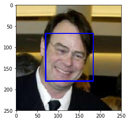
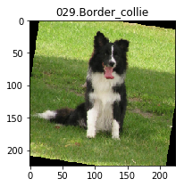

# Convolutional Neural Networks

## Project: Write an Algorithm for a Dog Identification App 

---

In this notebook, some template code has already been provided for you, and you will need to implement additional functionality to successfully complete this project. You will not need to modify the included code beyond what is requested. Sections that begin with **'(IMPLEMENTATION)'** in the header indicate that the following block of code will require additional functionality which you must provide. Instructions will be provided for each section, and the specifics of the implementation are marked in the code block with a 'TODO' statement. Please be sure to read the instructions carefully! 

> **Note**: Once you have completed all of the code implementations, you need to finalize your work by exporting the Jupyter Notebook as an HTML document. Before exporting the notebook to html, all of the code cells need to have been run so that reviewers can see the final implementation and output. You can then export the notebook by using the menu above and navigating to **File -> Download as -> HTML (.html)**. Include the finished document along with this notebook as your submission.

In addition to implementing code, there will be questions that you must answer which relate to the project and your implementation. Each section where you will answer a question is preceded by a **'Question X'** header. Carefully read each question and provide thorough answers in the following text boxes that begin with **'Answer:'**. Your project submission will be evaluated based on your answers to each of the questions and the implementation you provide.

>**Note:** Code and Markdown cells can be executed using the **Shift + Enter** keyboard shortcut.  Markdown cells can be edited by double-clicking the cell to enter edit mode.

The rubric contains _optional_ "Stand Out Suggestions" for enhancing the project beyond the minimum requirements. If you decide to pursue the "Stand Out Suggestions", you should include the code in this Jupyter notebook.


---
### Why We're Here 

In this notebook, you will make the first steps towards developing an algorithm that could be used as part of a mobile or web app.  At the end of this project, your code will accept any user-supplied image as input.  If a dog is detected in the image, it will provide an estimate of the dog's breed.  If a human is detected, it will provide an estimate of the dog breed that is most resembling.  The image below displays potential sample output of your finished project (... but we expect that each student's algorithm will behave differently!). 


In this real-world setting, you will need to piece together a series of models to perform different tasks; for instance, the algorithm that detects humans in an image will be different from the CNN that infers dog breed.  There are many points of possible failure, and no perfect algorithm exists.  Your imperfect solution will nonetheless create a fun user experience!

### The Road Ahead

We break the notebook into separate steps.  Feel free to use the links below to navigate the notebook.

* [Step 0](#step0): Import Datasets
* [Step 1](#step1): Detect Humans
* [Step 2](#step2): Detect Dogs
* [Step 3](#step3): Create a CNN to Classify Dog Breeds (from Scratch)
* [Step 4](#step4): Create a CNN to Classify Dog Breeds (using Transfer Learning)
* [Step 5](#step5): Write your Algorithm
* [Step 6](#step6): Test Your Algorithm

---
<a id='step0'></a>
## Step 0: Import Datasets

Make sure that you've downloaded the required human and dog datasets:

**Note: if you are using the Udacity workspace, you *DO NOT* need to re-download these - they can be found in the `/data` folder as noted in the cell below.**

* Download the [dog dataset](https://s3-us-west-1.amazonaws.com/udacity-aind/dog-project/dogImages.zip).  Unzip the folder and place it in this project's home directory, at the location `/dog_images`. 

* Download the [human dataset](https://s3-us-west-1.amazonaws.com/udacity-aind/dog-project/lfw.zip).  Unzip the folder and place it in the home directory, at location `/lfw`.  

*Note: If you are using a Windows machine, you are encouraged to use [7zip](http://www.7-zip.org/) to extract the folder.*

In the code cell below, we save the file paths for both the human (LFW) dataset and dog dataset in the numpy arrays `human_files` and `dog_files`.


```python
import numpy as np
from glob import glob

# load filenames for human and dog images
human_files = np.array(glob("/data/lfw/*/*"))
dog_files = np.array(glob("/data/dog_images/*/*/*"))

# print number of images in each dataset
print('There are %d total human images.' % len(human_files))
print('There are %d total dog images.' % len(dog_files))
```

    There are 13233 total human images.
    There are 8351 total dog images.


<a id='step1'></a>
## Step 1: Detect Humans

In this section, we use OpenCV's implementation of [Haar feature-based cascade classifiers](http://docs.opencv.org/trunk/d7/d8b/tutorial_py_face_detection.html) to detect human faces in images.  

OpenCV provides many pre-trained face detectors, stored as XML files on [github](https://github.com/opencv/opencv/tree/master/data/haarcascades).  We have downloaded one of these detectors and stored it in the `haarcascades` directory.  In the next code cell, we demonstrate how to use this detector to find human faces in a sample image.


```python
import cv2                
import matplotlib.pyplot as plt                        
%matplotlib inline                               

# extract pre-trained face detector
face_cascade = cv2.CascadeClassifier('haarcascades/haarcascade_frontalface_alt.xml')

# load color (BGR) image
img = cv2.imread(human_files[0])
# convert BGR image to grayscale
gray = cv2.cvtColor(img, cv2.COLOR_BGR2GRAY)

# find faces in image
faces = face_cascade.detectMultiScale(gray)

# print number of faces detected in the image
print('Number of faces detected:', len(faces))

# get bounding box for each detected face
for (x,y,w,h) in faces:
    # add bounding box to color image
    cv2.rectangle(img,(x,y),(x+w,y+h),(255,0,0),2)
    
# convert BGR image to RGB for plotting
cv_rgb = cv2.cvtColor(img, cv2.COLOR_BGR2RGB)

# display the image, along with bounding box
plt.imshow(cv_rgb)
plt.show()
```

    Number of faces detected: 1





Before using any of the face detectors, it is standard procedure to convert the images to grayscale.  The `detectMultiScale` function executes the classifier stored in `face_cascade` and takes the grayscale image as a parameter.  

In the above code, `faces` is a numpy array of detected faces, where each row corresponds to a detected face.  Each detected face is a 1D array with four entries that specifies the bounding box of the detected face.  The first two entries in the array (extracted in the above code as `x` and `y`) specify the horizontal and vertical positions of the top left corner of the bounding box.  The last two entries in the array (extracted here as `w` and `h`) specify the width and height of the box.

### Write a Human Face Detector

We can use this procedure to write a function that returns `True` if a human face is detected in an image and `False` otherwise.  This function, aptly named `face_detector`, takes a string-valued file path to an image as input and appears in the code block below.


```python
# returns "True" if face is detected in image stored at img_path
def face_detector(img_path):
    img = cv2.imread(img_path)
    gray = cv2.cvtColor(img, cv2.COLOR_BGR2GRAY)
    faces = face_cascade.detectMultiScale(gray)
    return len(faces) > 0
```

### (IMPLEMENTATION) Assess the Human Face Detector

__Question 1:__ Use the code cell below to test the performance of the `face_detector` function.  
- What percentage of the first 100 images in `human_files` have a detected human face?  
- What percentage of the first 100 images in `dog_files` have a detected human face? 

Ideally, we would like 100% of human images with a detected face and 0% of dog images with a detected face.  You will see that our algorithm falls short of this goal, but still gives acceptable performance.  We extract the file paths for the first 100 images from each of the datasets and store them in the numpy arrays `human_files_short` and `dog_files_short`.

__Answer:__ 
98% of the human images were detected as having a face whereas it is only 17% with dogs


```python
import time
from tqdm import tqdm

human_files_short = human_files[:100]
dog_files_short = dog_files[:100]

#-#-# Do NOT modify the code above this line. #-#-#

## TODO: Test the performance of the face_detector algorithm 
## on the images in human_files_short and dog_files_short.

human_in_human_dataset_count = np.sum([face_detector(i) for i in human_files_short])
human_in_dog_dataset_count = np.sum([face_detector(i) for i in dog_files_short])

# calculate and print percentage of faces in each sets
print('Human faces in human dataset detected: {}%'.format(human_in_human_dataset_count))
print('Human faces in dog dataset detected:   {}%'.format(human_in_dog_dataset_count))

```

    Human faces in human dataset detected: 98%
    Human faces in dog dataset detected:   17%


We suggest the face detector from OpenCV as a potential way to detect human images in your algorithm, but you are free to explore other approaches, especially approaches that make use of deep learning :).  Please use the code cell below to design and test your own face detection algorithm.  If you decide to pursue this _optional_ task, report performance on `human_files_short` and `dog_files_short`.


```python
### (Optional) 
### TODO: Test performance of anotherface detection algorithm.
### Feel free to use as many code cells as needed.

```

---
<a id='step2'></a>
## Step 2: Detect Dogs

In this section, we use a [pre-trained model](http://pytorch.org/docs/master/torchvision/models.html) to detect dogs in images.  

### Obtain Pre-trained VGG-16 Model

The code cell below downloads the VGG-16 model, along with weights that have been trained on [ImageNet](http://www.image-net.org/), a very large, very popular dataset used for image classification and other vision tasks.  ImageNet contains over 10 million URLs, each linking to an image containing an object from one of [1000 categories](https://gist.github.com/yrevar/942d3a0ac09ec9e5eb3a).  


```python
import torch
import torchvision.models as models

# define VGG16 model
VGG16 = models.vgg16(pretrained=True)

# check if CUDA is available
use_cuda = torch.cuda.is_available()
print(use_cuda)
```

    True


```python
# move model to GPU if CUDA is available
if use_cuda:
    VGG16 = VGG16.cuda()
    print('CUDA is available!  Training on GPU ...')
else:
    print('CUDA is not available.  Training on CPU ...')
```

    CUDA is available!  Training on GPU ...


```python
print(VGG16)
```

    VGG(
      (features): Sequential(
        (0): Conv2d(3, 64, kernel_size=(3, 3), stride=(1, 1), padding=(1, 1))
        (1): ReLU(inplace)
        (2): Conv2d(64, 64, kernel_size=(3, 3), stride=(1, 1), padding=(1, 1))
        (3): ReLU(inplace)
        (4): MaxPool2d(kernel_size=2, stride=2, padding=0, dilation=1, ceil_mode=False)
        (5): Conv2d(64, 128, kernel_size=(3, 3), stride=(1, 1), padding=(1, 1))
        (6): ReLU(inplace)
        (7): Conv2d(128, 128, kernel_size=(3, 3), stride=(1, 1), padding=(1, 1))
        (8): ReLU(inplace)
        (9): MaxPool2d(kernel_size=2, stride=2, padding=0, dilation=1, ceil_mode=False)
        (10): Conv2d(128, 256, kernel_size=(3, 3), stride=(1, 1), padding=(1, 1))
        (11): ReLU(inplace)
        (12): Conv2d(256, 256, kernel_size=(3, 3), stride=(1, 1), padding=(1, 1))
        (13): ReLU(inplace)
        (14): Conv2d(256, 256, kernel_size=(3, 3), stride=(1, 1), padding=(1, 1))
        (15): ReLU(inplace)
        (16): MaxPool2d(kernel_size=2, stride=2, padding=0, dilation=1, ceil_mode=False)
        (17): Conv2d(256, 512, kernel_size=(3, 3), stride=(1, 1), padding=(1, 1))
        (18): ReLU(inplace)
        (19): Conv2d(512, 512, kernel_size=(3, 3), stride=(1, 1), padding=(1, 1))
        (20): ReLU(inplace)
        (21): Conv2d(512, 512, kernel_size=(3, 3), stride=(1, 1), padding=(1, 1))
        (22): ReLU(inplace)
        (23): MaxPool2d(kernel_size=2, stride=2, padding=0, dilation=1, ceil_mode=False)
        (24): Conv2d(512, 512, kernel_size=(3, 3), stride=(1, 1), padding=(1, 1))
        (25): ReLU(inplace)
        (26): Conv2d(512, 512, kernel_size=(3, 3), stride=(1, 1), padding=(1, 1))
        (27): ReLU(inplace)
        (28): Conv2d(512, 512, kernel_size=(3, 3), stride=(1, 1), padding=(1, 1))
        (29): ReLU(inplace)
        (30): MaxPool2d(kernel_size=2, stride=2, padding=0, dilation=1, ceil_mode=False)
      )
      (classifier): Sequential(
        (0): Linear(in_features=25088, out_features=4096, bias=True)
        (1): ReLU(inplace)
        (2): Dropout(p=0.5)
        (3): Linear(in_features=4096, out_features=4096, bias=True)
        (4): ReLU(inplace)
        (5): Dropout(p=0.5)
        (6): Linear(in_features=4096, out_features=1000, bias=True)
      )
    )


Given an image, this pre-trained VGG-16 model returns a prediction (derived from the 1000 possible categories in ImageNet) for the object that is contained in the image.

### (IMPLEMENTATION) Making Predictions with a Pre-trained Model

In the next code cell, you will write a function that accepts a path to an image (such as `'dogImages/train/001.Affenpinscher/Affenpinscher_00001.jpg'`) as input and returns the index corresponding to the ImageNet class that is predicted by the pre-trained VGG-16 model.  The output should always be an integer between 0 and 999, inclusive.

Before writing the function, make sure that you take the time to learn  how to appropriately pre-process tensors for pre-trained models in the [PyTorch documentation](http://pytorch.org/docs/stable/torchvision/models.html).


```python
from PIL import Image
import torchvision.transforms as transforms

def VGG16_predict(img_path):
    '''
    Use pre-trained VGG-16 model to obtain index corresponding to 
    predicted ImageNet class for image at specified path
    
    Args:
        img_path: path to an image
        
    Returns:
        Index corresponding to VGG-16 model's prediction
    '''
    
    ## TODO: Complete the function.
    ## Load and pre-process an image from the given img_path
    ## Return the *index* of the predicted class for that image

    #Open jpg 
    img = Image.open(img_path)
    
    # convert img to tensor, to give it as an input for VGG16
    toTensor = transforms.ToTensor()
    
    # human face jpg file width 250
    # dog jpg file size ar various, and then resize/crop to 250
    transform_pipeline = transforms.Compose([transforms.RandomResizedCrop(250),
                                             transforms.ToTensor()])
    
    img_tensor = transform_pipeline(img)
    img_tensor = img_tensor.unsqueeze(0) 
    
    # move tensor to cuda
    if torch.cuda.is_available():
        img_tensor = img_tensor.cuda()

    prediction = VGG16(img_tensor)
    
    # move tensor to cpu, for cpu processing
    if torch.cuda.is_available():
        prediction = prediction.cpu()

    index = prediction.data.numpy().argmax()
        
    return index # predicted class index
```


```python
def process_image_to_tensor(image):
    ''' Scales, crops, and normalizes a PIL image for a PyTorch model,
        returns an tensor array

    As per Pytorch documentations: All pre-trained models expect input images normalized in the same way, 
    i.e. mini-batches of 3-channel RGB images
    of shape (3 x H x W), where H and W are expected to be at least 224. 
    The images have to be loaded in to a range of [0, 1] and 
    then normalized using mean = [0.485, 0.456, 0.406] and std = [0.229, 0.224, 0.225]. 
    You can use the following transform to normalize:
    '''
    # define transforms for the training data and testing data
    prediction_transforms = transforms.Compose([transforms.Resize(param_transform_resize),
                                          transforms.CenterCrop(param_transform_crop),
                                          transforms.ToTensor(),
                                          transforms.Normalize([0.485, 0.456, 0.406],
                                                               [0.229, 0.224, 0.225])])
    
    img_pil = Image.open( image ).convert('RGB')
    img_tensor = prediction_transforms( img_pil )[:3,:,:].unsqueeze(0)
    
    return img_tensor


# helper function for un-normalizing an image  - from STYLE TRANSFER exercise
# and converting it from a Tensor image to a NumPy image for display
def image_convert(tensor):
    """ Display a tensor as an image. """
    
    image = tensor.to("cpu").clone().detach()
    image = image.numpy().squeeze()
    image = image.transpose(1,2,0)
    image = image * np.array((0.229, 0.224, 0.225)) + np.array((0.485, 0.456, 0.406))
    image = image.clip(0, 1)

    return image
```


```python
# show test image
param_test_dog_image = '/data/dog_images/train/001.Affenpinscher/Affenpinscher_00001.jpg'
dog_image = Image.open( param_test_dog_image )
plt.imshow(dog_image)
plt.show()
```


### (IMPLEMENTATION) Write a Dog Detector

While looking at the [dictionary](https://gist.github.com/yrevar/942d3a0ac09ec9e5eb3a), you will notice that the categories corresponding to dogs appear in an uninterrupted sequence and correspond to dictionary keys 151-268, inclusive, to include all categories from `'Chihuahua'` to `'Mexican hairless'`.  Thus, in order to check to see if an image is predicted to contain a dog by the pre-trained VGG-16 model, we need only check if the pre-trained model predicts an index between 151 and 268 (inclusive).

Use these ideas to complete the `dog_detector` function below, which returns `True` if a dog is detected in an image (and `False` if not).


```python
### returns "True" if a dog is detected in the image stored at img_path
def dog_detector(img_path):
    ## TODO: Complete the function.
    index = VGG16_predict(img_path)
        
    return (151 <= index and index <= 268) # true/false
```

### (IMPLEMENTATION) Assess the Dog Detector

__Question 2:__ Use the code cell below to test the performance of your `dog_detector` function.  
- What percentage of the images in `human_files_short` have a detected dog?  
- What percentage of the images in `dog_files_short` have a detected dog?

__Answer:__ 


```python
### TODO: Test the performance of the dog_detector function
### on the images in human_files_short and dog_files_short.

human_files_detected_as_human = (np.average([dog_detector(img) for img in human_files_short]) *100)
#human_files_detected_as_human = sum( [dog_detector(image) for image in human_files_short] )

dog_files_detected_as_human = (np.average([dog_detector(img) for img in dog_files_short]) *100)
#dog_files_detected_as_human = sum( [dog_detector(image) for image in dog_files_short] )

print("Percentage of first 100 images where humans detected as a dog: {}%".format(human_files_detected_as_human))
print("Percentage of first 100 images where dogs detected as a dog:   {}%".format(dog_files_detected_as_human))
```

    Percentage of first 100 images where humans detected as a dog: 0.0%
    Percentage of first 100 images where dogs detected as a dog:   83.0%


We suggest VGG-16 as a potential network to detect dog images in your algorithm, but you are free to explore other pre-trained networks (such as [Inception-v3](http://pytorch.org/docs/master/torchvision/models.html#inception-v3), [ResNet-50](http://pytorch.org/docs/master/torchvision/models.html#id3), etc).  Please use the code cell below to test other pre-trained PyTorch models.  If you decide to pursue this _optional_ task, report performance on `human_files_short` and `dog_files_short`.


```python
### (Optional) 
### TODO: Report the performance of another pre-trained network.
### Feel free to use as many code cells as needed.
```

---
<a id='step3'></a>
## Step 3: Create a CNN to Classify Dog Breeds (from Scratch)

Now that we have functions for detecting humans and dogs in images, we need a way to predict breed from images.  In this step, you will create a CNN that classifies dog breeds.  You must create your CNN _from scratch_ (so, you can't use transfer learning _yet_!), and you must attain a test accuracy of at least 10%.  In Step 4 of this notebook, you will have the opportunity to use transfer learning to create a CNN that attains greatly improved accuracy.

We mention that the task of assigning breed to dogs from images is considered exceptionally challenging.  To see why, consider that *even a human* would have trouble distinguishing between a Brittany and a Welsh Springer Spaniel.  

Brittany | Welsh Springer Spaniel
- | - 
 | 

It is not difficult to find other dog breed pairs with minimal inter-class variation (for instance, Curly-Coated Retrievers and American Water Spaniels).  

Curly-Coated Retriever | American Water Spaniel
- | -
 | 


Likewise, recall that labradors come in yellow, chocolate, and black.  Your vision-based algorithm will have to conquer this high intra-class variation to determine how to classify all of these different shades as the same breed.  

Yellow Labrador | Chocolate Labrador | Black Labrador
- | -
 |  | 

We also mention that random chance presents an exceptionally low bar: setting aside the fact that the classes are slightly imabalanced, a random guess will provide a correct answer roughly 1 in 133 times, which corresponds to an accuracy of less than 1%.  

Remember that the practice is far ahead of the theory in deep learning.  Experiment with many different architectures, and trust your intuition.  And, of course, have fun!

### (IMPLEMENTATION) Specify Data Loaders for the Dog Dataset

Use the code cell below to write three separate [data loaders](http://pytorch.org/docs/stable/data.html#torch.utils.data.DataLoader) for the training, validation, and test datasets of dog images (located at `dog_images/train`, `dog_images/valid`, and `dog_images/test`, respectively).  You may find [this documentation on custom datasets](http://pytorch.org/docs/stable/torchvision/datasets.html) to be a useful resource.  If you are interested in augmenting your training and/or validation data, check out the wide variety of [transforms](http://pytorch.org/docs/stable/torchvision/transforms.html?highlight=transform)!


```python
import os
from torchvision import datasets
from PIL import ImageFile

ImageFile.LOAD_TRUNCATED_IMAGES = True

### TODO: Write data loaders for training, validation, and test sets
## Specify appropriate transforms, and batch_sizes

#Paramaters Setting
param_transform_resize = 224
param_transform_crop = 224
param_data_directory = "/data/dog_images"

print("load image data ... ")
# define transforms for the training data and testing data
train_transforms = transforms.Compose([transforms.Resize(param_transform_resize),
                                       transforms.CenterCrop(param_transform_crop),
                                       transforms.RandomHorizontalFlip(),
                                       transforms.RandomVerticalFlip(),
                                       transforms.RandomRotation(20),
                                       transforms.ToTensor(),
                                       transforms.Normalize([0.485, 0.456, 0.406],
                                                            [0.229, 0.224, 0.225])])

test_transforms = transforms.Compose([transforms.Resize(param_transform_resize),
                                      transforms.CenterCrop(param_transform_crop),
                                      transforms.ToTensor(),
                                      transforms.Normalize([0.485, 0.456, 0.406],
                                                           [0.229, 0.224, 0.225])])


# pass transforms in here, then run the next cell to see how the transforms look
train_data = datasets.ImageFolder( param_data_directory + '/train', transform=train_transforms )
test_data = datasets.ImageFolder( param_data_directory + '/test', transform=test_transforms )
valid_data = datasets.ImageFolder( param_data_directory + '/valid', transform=test_transforms )

# ---- print out some data stats ----
print('  Number of train images: ', len(train_data))
print('  Number of test images:  ', len(test_data))
print('  Number of valid images: ', len(valid_data))
# -----------------------------------

trainloader = torch.utils.data.DataLoader( train_data, batch_size=32, shuffle=True )
testloader = torch.utils.data.DataLoader( test_data, batch_size=16 )
validloader = torch.utils.data.DataLoader( valid_data, batch_size=16 )

# create dictionary for all loaders in one
loaders_scratch = {}
loaders_scratch['train'] = trainloader
loaders_scratch['valid'] = validloader
loaders_scratch['test'] = testloader

print("done.")
```

    load image data ... 
      Number of train images:  6680
      Number of test images:   836
      Number of valid images:  835
    done.


```python
# get classes of training datas
class_names = train_data.classes
number_classes = len(class_names)

# correct output-size of the CNN
param_output_size = len(class_names)

print("number of classes:", number_classes)
print("")
print("class names: \n", class_names)
```

    number of classes: 133
    
    class names: 
     ['001.Affenpinscher', '002.Afghan_hound', '003.Airedale_terrier', '004.Akita', '005.Alaskan_malamute', '006.American_eskimo_dog', '007.American_foxhound', '008.American_staffordshire_terrier', '009.American_water_spaniel', '010.Anatolian_shepherd_dog', '011.Australian_cattle_dog', '012.Australian_shepherd', '013.Australian_terrier', '014.Basenji', '015.Basset_hound', '016.Beagle', '017.Bearded_collie', '018.Beauceron', '019.Bedlington_terrier', '020.Belgian_malinois', '021.Belgian_sheepdog', '022.Belgian_tervuren', '023.Bernese_mountain_dog', '024.Bichon_frise', '025.Black_and_tan_coonhound', '026.Black_russian_terrier', '027.Bloodhound', '028.Bluetick_coonhound', '029.Border_collie', '030.Border_terrier', '031.Borzoi', '032.Boston_terrier', '033.Bouvier_des_flandres', '034.Boxer', '035.Boykin_spaniel', '036.Briard', '037.Brittany', '038.Brussels_griffon', '039.Bull_terrier', '040.Bulldog', '041.Bullmastiff', '042.Cairn_terrier', '043.Canaan_dog', '044.Cane_corso', '045.Cardigan_welsh_corgi', '046.Cavalier_king_charles_spaniel', '047.Chesapeake_bay_retriever', '048.Chihuahua', '049.Chinese_crested', '050.Chinese_shar-pei', '051.Chow_chow', '052.Clumber_spaniel', '053.Cocker_spaniel', '054.Collie', '055.Curly-coated_retriever', '056.Dachshund', '057.Dalmatian', '058.Dandie_dinmont_terrier', '059.Doberman_pinscher', '060.Dogue_de_bordeaux', '061.English_cocker_spaniel', '062.English_setter', '063.English_springer_spaniel', '064.English_toy_spaniel', '065.Entlebucher_mountain_dog', '066.Field_spaniel', '067.Finnish_spitz', '068.Flat-coated_retriever', '069.French_bulldog', '070.German_pinscher', '071.German_shepherd_dog', '072.German_shorthaired_pointer', '073.German_wirehaired_pointer', '074.Giant_schnauzer', '075.Glen_of_imaal_terrier', '076.Golden_retriever', '077.Gordon_setter', '078.Great_dane', '079.Great_pyrenees', '080.Greater_swiss_mountain_dog', '081.Greyhound', '082.Havanese', '083.Ibizan_hound', '084.Icelandic_sheepdog', '085.Irish_red_and_white_setter', '086.Irish_setter', '087.Irish_terrier', '088.Irish_water_spaniel', '089.Irish_wolfhound', '090.Italian_greyhound', '091.Japanese_chin', '092.Keeshond', '093.Kerry_blue_terrier', '094.Komondor', '095.Kuvasz', '096.Labrador_retriever', '097.Lakeland_terrier', '098.Leonberger', '099.Lhasa_apso', '100.Lowchen', '101.Maltese', '102.Manchester_terrier', '103.Mastiff', '104.Miniature_schnauzer', '105.Neapolitan_mastiff', '106.Newfoundland', '107.Norfolk_terrier', '108.Norwegian_buhund', '109.Norwegian_elkhound', '110.Norwegian_lundehund', '111.Norwich_terrier', '112.Nova_scotia_duck_tolling_retriever', '113.Old_english_sheepdog', '114.Otterhound', '115.Papillon', '116.Parson_russell_terrier', '117.Pekingese', '118.Pembroke_welsh_corgi', '119.Petit_basset_griffon_vendeen', '120.Pharaoh_hound', '121.Plott', '122.Pointer', '123.Pomeranian', '124.Poodle', '125.Portuguese_water_dog', '126.Saint_bernard', '127.Silky_terrier', '128.Smooth_fox_terrier', '129.Tibetan_mastiff', '130.Welsh_springer_spaniel', '131.Wirehaired_pointing_griffon', '132.Xoloitzcuintli', '133.Yorkshire_terrier']


```python
# test train loaders to see how it looks like
# get a batch of training datas
inputs, classes = next( iter(loaders_scratch['train']) )

for image, label in zip(inputs, classes): 
    image = image.to("cpu").clone().detach()
    image = image.numpy().squeeze()
    image = image.transpose(1,2,0)
    # normalize image
    image = image * np.array((0.229, 0.224, 0.225)) + np.array((0.485, 0.456, 0.406))
    image = image.clip(0, 1)
     
    fig = plt.figure(figsize=(12,3))
    plt.imshow(image)
    plt.title(class_names[label])
```

    /opt/conda/lib/python3.6/site-packages/matplotlib/pyplot.py:523: RuntimeWarning: More than 20 figures have been opened. Figures created through the pyplot interface (`matplotlib.pyplot.figure`) are retained until explicitly closed and may consume too much memory. (To control this warning, see the rcParam `figure.max_open_warning`).
      max_open_warning, RuntimeWarning)





**Question 3:** Describe your chosen procedure for preprocessing the data. 
- How does your code resize the images (by cropping, stretching, etc)?  What size did you pick for the input tensor, and why?
- Did you decide to augment the dataset?  If so, how (through translations, flips, rotations, etc)?  If not, why not?


**Answer**:

I loaded the training, test and validation datas, then I created DataLoaders for each of these sets of datas. After this, I resized all image to 224 pixel, center cropped, add randomly horizontal / vertical flip / rotations for some degrees to avoid overfitting of the model.

I tried to approached the problem iteratively and starting with the examples from the previous labs and in this project, I am working with (224, 224, 3) images, so the inputs are significantly bigger than the labs (28, 28, 1) for Mnist and (32x32x3) for CIFAR.

I've also realized that the most of the pre-trained models require the input to be 224x224 pixel images. Also, I'll need to match the normalization used when the models were trained. Each color channel has to normalized separately, the means are [0.485, 0.456, 0.406] and the standard deviations are [0.229, 0.224, 0.225].

### (IMPLEMENTATION) Model Architecture

Create a CNN to classify dog breed.  Use the template in the code cell below.


```python
import torch.nn as nn
import torch.nn.functional as F

# define the CNN architecture
class Net(nn.Module):
    ### TODO: choose an architecture, and complete the class
    
    def __init__(self):
        super(Net, self).__init__()
        print("create model ... ", end="")
        
        ## Define layers of a CNN
        # convolutional layer (sees 224x224x3 image tensor)
        
        self.conv1 = nn.Conv2d(3, 16, 3, padding=1)
        
        # convolutional layer (sees 112x112x16 tensor)
        
        self.conv2 = nn.Conv2d(16, 32, 3, padding=1)
        
        # convolutional layer (sees 56x56x32 tensor)
        
        self.conv3 = nn.Conv2d(32, 64, 3, padding=1)
        
        # max pooling layer
        
        self.pool = nn.MaxPool2d(2, 2)

        # linear layer (sees 28x28x64 -> 500)
        self.fc1 = nn.Linear(28 * 28 * 64, 500)
        # linear layer (500 -> 133)
        self.fc2 = nn.Linear(500, param_output_size)
        # dropout layer (p=0.25)
        self.dropout = nn.Dropout(0.25)
        # batch norm 
        self.batch_norm = nn.BatchNorm1d(num_features=500)
        print("done")
    
    def forward(self, x):
        ## Define forward behavior
        # add sequence of convolutional and max pooling layers
        x = self.pool(F.relu(self.conv1(x)))
        x = self.pool(F.relu(self.conv2(x)))
        x = self.pool(F.relu(self.conv3(x)))
        
        # flatten image input --> 28 * 28 * 64 = 50176
        x = x.view(x.size(0), -1)
        # add dropout layer
        x = self.dropout(x)
        # add 1st hidden layer, with relu activation function
        x = F.relu(self.batch_norm( self.fc1(x)) )
        # add dropout layer
        x = self.dropout(x)
        # add 2nd hidden layer, with relu activation function
        x = self.fc2(x)
        return x

#-#-# You so NOT have to modify the code below this line. #-#-#

# instantiate the CNN
model_scratch = Net()
print(model_scratch)

# move tensors to GPU if CUDA is available
if use_cuda:
    model_scratch.cuda()
```

    create model ... done
    Net(
      (conv1): Conv2d(3, 16, kernel_size=(3, 3), stride=(1, 1), padding=(1, 1))
      (conv2): Conv2d(16, 32, kernel_size=(3, 3), stride=(1, 1), padding=(1, 1))
      (conv3): Conv2d(32, 64, kernel_size=(3, 3), stride=(1, 1), padding=(1, 1))
      (pool): MaxPool2d(kernel_size=2, stride=2, padding=0, dilation=1, ceil_mode=False)
      (fc1): Linear(in_features=50176, out_features=500, bias=True)
      (fc2): Linear(in_features=500, out_features=133, bias=True)
      (dropout): Dropout(p=0.25)
      (batch_norm): BatchNorm1d(500, eps=1e-05, momentum=0.1, affine=True, track_running_stats=True)
    )


__Question 4:__ Outline the steps you took to get to your final CNN architecture and your reasoning at each step.  

__Answer:__ 

The first layer has input size of (224, 224, 3) and last layer should have the output size of 133 classes.

I started adding convolutional layers (stack of filtered images) and maxpooling layers (reduce the x-y size of an input, keeping only the most active pixels from the previous layer), as well as the usual linear + dropout layers to avoid overfitting and produce a 133-dim output.

MaxPooling2D seems to be a common choice to down-sample in these type of classification problems and that is the reason why I chose it. The more convolutional layers I includeed, the more complex patterns in color and shape a model can the model detect.

The first layer in the CNN is a convolutional layer that takes (224, 224, 3) input size.

I'd like the new layer to have 16 filters, each with a height and width of 3. When performing the convolution, I'd like the filter to jump 1 pixel at a time.

_nn.Conv2d(in_channels, out_channels, kernelsize, stride=1, padding=0)

I want this layer to have the same width and height as the input layer, so I will pad accordingly;
Then, to construct this convolutional layer, I use the following line of code:

self.conv2 = nn.Conv2d(3, 32, 3, padding=1)

I am adding a pool layer that takes a kernel_size and a stride after every convolution layer. This will down-sample the input's x-y dimensions, by a factor of 2:

self.pool = nn.MaxPool2d(2,2)

I am adding a fully connected linear layer at the end to produce a 133-dim output. As well as a Dropout layer to avoid overfitting.

A forward pass would give the following structure:

    torch.Size([16, 3, 224, 224])

    torch.Size([16, 16, 112, 112])

    torch.Size([16, 32, 56, 56])

    torch.Size([16, 64, 28, 28])

    torch.Size([16, 50176])

    torch.Size([16, 500])

    torch.Size([16, 133])

### (IMPLEMENTATION) Specify Loss Function and Optimizer

Use the next code cell to specify a [loss function](http://pytorch.org/docs/stable/nn.html#loss-functions) and [optimizer](http://pytorch.org/docs/stable/optim.html).  Save the chosen loss function as `criterion_scratch`, and the optimizer as `optimizer_scratch` below.


```python
import torch.optim as optim

#Param definition
param_learning_rate = 0.01 

### TODO: select loss function
criterion_scratch = nn.CrossEntropyLoss()

### TODO: select optimizer
optimizer_scratch = optim.SGD(model_scratch.parameters(), lr=param_learning_rate)
```

### (IMPLEMENTATION) Train and Validate the Model

Train and validate your model in the code cell below.  [Save the final model parameters](http://pytorch.org/docs/master/notes/serialization.html) at filepath `'model_scratch.pt'`.


```python
def train(n_epochs, loaders, model, optimizer, criterion, use_cuda, save_path):
    """returns trained model"""
    print("start training for {} epochs ...".format(n_epochs))
    # initialize tracker for minimum validation loss
    valid_loss_min = np.Inf 
    
    # exist save-file, load save file
    if os.path.exists(save_path):
        print("load previous saved model ...")
        model.load_state_dict(torch.load(save_path))
        
    for epoch in range(1, n_epochs+1):
        # initialize variables to monitor training and validation loss
        train_loss = 0.0
        valid_loss = 0.0
        
        ###################
        # train the model #
        ###################
        model.train()    # --- set model to train mode
        for batch_idx, (data, target) in enumerate(loaders['train']):
            # move to GPU
            if use_cuda:
                data, target = data.cuda(), target.cuda()
            ## find the loss and update the model parameters accordingly
            ## record the average training loss, using something like
            ## train_loss = train_loss + ((1 / (batch_idx + 1)) * (loss.data - train_loss))
            # -----------------------------
            # clear the gradients of all optimized variables
            optimizer.zero_grad()
            # forward pass: compute predicted outputs by passing inputs to the model
            output = model(data)
            # calculate the batch loss
            loss = criterion(output, target)
            # backward pass: compute gradient of the loss with respect to model parameters
            loss.backward()
            # perform a single optimization step (parameter update)
            optimizer.step()
            # update training loss
            #train_loss = train_loss + ((1 / (batch_idx + 1)) * (loss.data - train_loss))
            train_loss += loss.item()*data.size(0)
            # -----------------------------
            
        ######################    
        # validate the model #
        ######################
        model.eval()        # ---- set model to evaluation mode
        for batch_idx, (data, target) in enumerate(loaders['valid']):
            # move to GPU
            if use_cuda:
                data, target = data.cuda(), target.cuda()
            ## update the average validation loss
            # -----------------------------
            # forward pass: compute predicted outputs by passing inputs to the model
            output = model(data)
            # calculate the batch loss
            loss = criterion(output, target)
            # update average validation loss 
            valid_loss += loss.item() * data.size(0)
            # -----------------------------
            
        # -----------------------------    
        # calculate average losses
        train_loss = train_loss / len(loaders['train'].dataset)
        valid_loss = valid_loss / len(loaders['valid'].dataset)
        # -----------------------------
        
        # print training/validation statistics 
        print('Epoch: {} \tTraining Loss: {:.6f} \tValidation Loss: {:.6f}'.format( epoch, train_loss, valid_loss ),end="")
        
        ## TODO: save the model if validation loss has decreased
        # -----------------------------
        # save model if validation loss has decreased
        if valid_loss <= valid_loss_min:
            #print('Validation loss decreased ({:.6f} --> {:.6f}).  Saving model ...'.format(valid_loss_min, valid_loss))
            print('  Saving model ...')
            torch.save(model.state_dict(), save_path)
            valid_loss_min = valid_loss
        else:
            print("")
        # -----------------------------
    
    print("done")
    # return trained model
    return model
```


```python
# ---Defining Param-----

param_epochs = 50

# train the model
model_scratch = train(param_epochs, loaders_scratch, model_scratch, optimizer_scratch, 
                      criterion_scratch, use_cuda, 'model_scratch.pt')
```

    start training for 50 epochs ...
    load previous saved model ...
    Epoch: 1 	Training Loss: 4.452849 	Validation Loss: 4.437132  Saving model ...
    Epoch: 2 	Training Loss: 4.351674 	Validation Loss: 4.388084  Saving model ...
    Epoch: 3 	Training Loss: 4.268519 	Validation Loss: 4.312283  Saving model ...
    Epoch: 4 	Training Loss: 4.181270 	Validation Loss: 4.247474  Saving model ...
    Epoch: 5 	Training Loss: 4.121010 	Validation Loss: 4.199620  Saving model ...
    Epoch: 6 	Training Loss: 4.058476 	Validation Loss: 4.187343  Saving model ...
    Epoch: 7 	Training Loss: 4.000240 	Validation Loss: 4.142488  Saving model ...
    Epoch: 8 	Training Loss: 3.931323 	Validation Loss: 4.079091  Saving model ...
    Epoch: 9 	Training Loss: 3.874273 	Validation Loss: 4.057658  Saving model ...
    Epoch: 10 	Training Loss: 3.819831 	Validation Loss: 4.058198
    Epoch: 11 	Training Loss: 3.759465 	Validation Loss: 4.008260  Saving model ...
    Epoch: 12 	Training Loss: 3.705003 	Validation Loss: 3.923014  Saving model ...
    Epoch: 13 	Training Loss: 3.651802 	Validation Loss: 3.941137
    Epoch: 14 	Training Loss: 3.599453 	Validation Loss: 3.884931  Saving model ...
    Epoch: 15 	Training Loss: 3.524598 	Validation Loss: 3.850691  Saving model ...
    Epoch: 16 	Training Loss: 3.482064 	Validation Loss: 3.864028
    Epoch: 17 	Training Loss: 3.420445 	Validation Loss: 3.786575  Saving model ...
    Epoch: 18 	Training Loss: 3.374439 	Validation Loss: 3.771919  Saving model ...
    Epoch: 19 	Training Loss: 3.303236 	Validation Loss: 3.742495  Saving model ...
    Epoch: 20 	Training Loss: 3.249663 	Validation Loss: 3.740621  Saving model ...
    Epoch: 21 	Training Loss: 3.191527 	Validation Loss: 3.731253  Saving model ...
    Epoch: 22 	Training Loss: 3.134671 	Validation Loss: 3.721596  Saving model ...
    Epoch: 23 	Training Loss: 3.097025 	Validation Loss: 3.646863  Saving model ...
    Epoch: 24 	Training Loss: 3.026832 	Validation Loss: 3.820343
    Epoch: 25 	Training Loss: 2.965049 	Validation Loss: 3.639160  Saving model ...
    Epoch: 26 	Training Loss: 2.910247 	Validation Loss: 3.652683
    Epoch: 27 	Training Loss: 2.851933 	Validation Loss: 3.551481  Saving model ...
    Epoch: 28 	Training Loss: 2.809508 	Validation Loss: 3.607346
    Epoch: 29 	Training Loss: 2.746071 	Validation Loss: 3.549424  Saving model ...
    Epoch: 30 	Training Loss: 2.689210 	Validation Loss: 3.535606  Saving model ...
    Epoch: 31 	Training Loss: 2.634034 	Validation Loss: 3.571457
    Epoch: 32 	Training Loss: 2.568730 	Validation Loss: 3.550697
    Epoch: 33 	Training Loss: 2.528149 	Validation Loss: 3.567808
    Epoch: 34 	Training Loss: 2.474327 	Validation Loss: 3.558727
    Epoch: 35 	Training Loss: 2.427845 	Validation Loss: 3.598677
    Epoch: 36 	Training Loss: 2.361488 	Validation Loss: 3.591858
    Epoch: 37 	Training Loss: 2.325996 	Validation Loss: 3.554950
    Epoch: 38 	Training Loss: 2.238488 	Validation Loss: 3.565141
    Epoch: 39 	Training Loss: 2.209319 	Validation Loss: 3.553918
    Epoch: 40 	Training Loss: 2.136338 	Validation Loss: 3.493201  Saving model ...
    Epoch: 41 	Training Loss: 2.093909 	Validation Loss: 3.483635  Saving model ...
    Epoch: 42 	Training Loss: 2.046277 	Validation Loss: 3.474967  Saving model ...
    Epoch: 43 	Training Loss: 2.012273 	Validation Loss: 3.663723
    Epoch: 44 	Training Loss: 1.962771 	Validation Loss: 3.474239  Saving model ...
    Epoch: 45 	Training Loss: 1.899318 	Validation Loss: 3.445526  Saving model ...
    Epoch: 46 	Training Loss: 1.853694 	Validation Loss: 3.425345  Saving model ...
    Epoch: 47 	Training Loss: 1.820599 	Validation Loss: 3.536850
    Epoch: 48 	Training Loss: 1.769739 	Validation Loss: 3.474439
    Epoch: 49 	Training Loss: 1.716192 	Validation Loss: 3.532613
    Epoch: 50 	Training Loss: 1.673011 	Validation Loss: 3.501839
    done


### (IMPLEMENTATION) Test the Model

Try out your model on the test dataset of dog images.  Use the code cell below to calculate and print the test loss and accuracy.  Ensure that your test accuracy is greater than 10%.


```python
def test(loaders, model, criterion, use_cuda):

    # monitor test loss and accuracy
    test_loss = 0.
    correct = 0.
    total = 0.

    model.eval()
    for batch_idx, (data, target) in enumerate(loaders['test']):
        # move to GPU
        if use_cuda:
            data, target = data.cuda(), target.cuda()
        # forward pass: compute predicted outputs by passing inputs to the model
        output = model(data)
        # calculate the loss
        loss = criterion(output, target)
        # update average test loss 
        test_loss = test_loss + ((1 / (batch_idx + 1)) * (loss.data - test_loss))
        # convert output probabilities to predicted class
        pred = output.data.max(1, keepdim=True)[1]
        # compare predictions to true label
        correct += np.sum(np.squeeze(pred.eq(target.data.view_as(pred))).cpu().numpy())
        total += data.size(0)
            
    print('Test Loss: {:.6f}\n'.format(test_loss))

    print('\nTest Accuracy: %2d%% (%2d/%2d)' % (
        100. * correct / total, correct, total))

# call test function    
test(loaders_scratch, model_scratch, criterion_scratch, use_cuda)
```

    Test Loss: 3.618330
    
    
    Test Accuracy: 18% (158/836)


---
<a id='step4'></a>
## Step 4: Create a CNN to Classify Dog Breeds (using Transfer Learning)

You will now use transfer learning to create a CNN that can identify dog breed from images.  Your CNN must attain at least 60% accuracy on the test set.

### (IMPLEMENTATION) Specify Data Loaders for the Dog Dataset

Use the code cell below to write three separate [data loaders](http://pytorch.org/docs/master/data.html#torch.utils.data.DataLoader) for the training, validation, and test datasets of dog images (located at `dogImages/train`, `dogImages/valid`, and `dogImages/test`, respectively). 

If you like, **you are welcome to use the same data loaders from the previous step**, when you created a CNN from scratch.


```python
## TODO: Specify data loaders
loaders_transfer = loaders_scratch
```


```python
## TODO: Specify another data loaders

loaders_transfer_wfc = loaders_scratch.copy()
```

### (IMPLEMENTATION) Model Architecture

Use transfer learning to create a CNN to classify dog breed.  Use the code cell below, and save your initialized model as the variable `model_transfer`.


```python
import torchvision.models as models
import torch.nn as nn

## TODO: Specify model architecture 
model_transfer = models.vgg19(pretrained=True)

if use_cuda:
    model_transfer = model_transfer.cuda()
    
print(model_transfer)
```

    VGG(
      (features): Sequential(
        (0): Conv2d(3, 64, kernel_size=(3, 3), stride=(1, 1), padding=(1, 1))
        (1): ReLU(inplace)
        (2): Conv2d(64, 64, kernel_size=(3, 3), stride=(1, 1), padding=(1, 1))
        (3): ReLU(inplace)
        (4): MaxPool2d(kernel_size=2, stride=2, padding=0, dilation=1, ceil_mode=False)
        (5): Conv2d(64, 128, kernel_size=(3, 3), stride=(1, 1), padding=(1, 1))
        (6): ReLU(inplace)
        (7): Conv2d(128, 128, kernel_size=(3, 3), stride=(1, 1), padding=(1, 1))
        (8): ReLU(inplace)
        (9): MaxPool2d(kernel_size=2, stride=2, padding=0, dilation=1, ceil_mode=False)
        (10): Conv2d(128, 256, kernel_size=(3, 3), stride=(1, 1), padding=(1, 1))
        (11): ReLU(inplace)
        (12): Conv2d(256, 256, kernel_size=(3, 3), stride=(1, 1), padding=(1, 1))
        (13): ReLU(inplace)
        (14): Conv2d(256, 256, kernel_size=(3, 3), stride=(1, 1), padding=(1, 1))
        (15): ReLU(inplace)
        (16): Conv2d(256, 256, kernel_size=(3, 3), stride=(1, 1), padding=(1, 1))
        (17): ReLU(inplace)
        (18): MaxPool2d(kernel_size=2, stride=2, padding=0, dilation=1, ceil_mode=False)
        (19): Conv2d(256, 512, kernel_size=(3, 3), stride=(1, 1), padding=(1, 1))
        (20): ReLU(inplace)
        (21): Conv2d(512, 512, kernel_size=(3, 3), stride=(1, 1), padding=(1, 1))
        (22): ReLU(inplace)
        (23): Conv2d(512, 512, kernel_size=(3, 3), stride=(1, 1), padding=(1, 1))
        (24): ReLU(inplace)
        (25): Conv2d(512, 512, kernel_size=(3, 3), stride=(1, 1), padding=(1, 1))
        (26): ReLU(inplace)
        (27): MaxPool2d(kernel_size=2, stride=2, padding=0, dilation=1, ceil_mode=False)
        (28): Conv2d(512, 512, kernel_size=(3, 3), stride=(1, 1), padding=(1, 1))
        (29): ReLU(inplace)
        (30): Conv2d(512, 512, kernel_size=(3, 3), stride=(1, 1), padding=(1, 1))
        (31): ReLU(inplace)
        (32): Conv2d(512, 512, kernel_size=(3, 3), stride=(1, 1), padding=(1, 1))
        (33): ReLU(inplace)
        (34): Conv2d(512, 512, kernel_size=(3, 3), stride=(1, 1), padding=(1, 1))
        (35): ReLU(inplace)
        (36): MaxPool2d(kernel_size=2, stride=2, padding=0, dilation=1, ceil_mode=False)
      )
      (classifier): Sequential(
        (0): Linear(in_features=25088, out_features=4096, bias=True)
        (1): ReLU(inplace)
        (2): Dropout(p=0.5)
        (3): Linear(in_features=4096, out_features=4096, bias=True)
        (4): ReLU(inplace)
        (5): Dropout(p=0.5)
        (6): Linear(in_features=4096, out_features=1000, bias=True)
      )
    )


__Question 5:__ Outline the steps you took to get to your final CNN architecture and your reasoning at each step.  Describe why you think the architecture is suitable for the current problem.

__Answer:__ 

I think it is very efficient to use pre-trained networks and solve many problems in computer vision.

Once trained, these models work very well for feature detectors for images they were not trained on. Here I'll use transfer learning to train a network that can classify the dog images.

Specifically for this task, I'll use a VGG-16 and VGG-19 model from torchvision model archiv, which was already  trained previously.

The classifier part of the model is a single fully-connected layer:

classifier[6]: (6): Linear(in_features=4096, out_features=1000, bias=True)

This layer was already trained on the ImageNet dataset, so it won't work for the dog classification specific problem with different output size, means I need to replace the classifier (133 classes), but I guess the features will work perfectly on their own.

I was experimenting a little bit with the output function of the model with the classifiers / optimizers. 

Here is my best outcome, which i've got with the follwing code.


```python
# this is needed for pre-trained networks
# freeze parameters so we don't backprop through them
for param in model_transfer.parameters():
    param.requires_grad = False


# replace the last fully connected layer with a Linnear layer with 133 out features (param_output_size)
model_transfer.classifier[6] = nn.Linear(4096, param_output_size, bias=True)

if use_cuda:
    model_transfer = model_transfer.cuda()
    
print(model_transfer)
```

    VGG(
      (features): Sequential(
        (0): Conv2d(3, 64, kernel_size=(3, 3), stride=(1, 1), padding=(1, 1))
        (1): ReLU(inplace)
        (2): Conv2d(64, 64, kernel_size=(3, 3), stride=(1, 1), padding=(1, 1))
        (3): ReLU(inplace)
        (4): MaxPool2d(kernel_size=2, stride=2, padding=0, dilation=1, ceil_mode=False)
        (5): Conv2d(64, 128, kernel_size=(3, 3), stride=(1, 1), padding=(1, 1))
        (6): ReLU(inplace)
        (7): Conv2d(128, 128, kernel_size=(3, 3), stride=(1, 1), padding=(1, 1))
        (8): ReLU(inplace)
        (9): MaxPool2d(kernel_size=2, stride=2, padding=0, dilation=1, ceil_mode=False)
        (10): Conv2d(128, 256, kernel_size=(3, 3), stride=(1, 1), padding=(1, 1))
        (11): ReLU(inplace)
        (12): Conv2d(256, 256, kernel_size=(3, 3), stride=(1, 1), padding=(1, 1))
        (13): ReLU(inplace)
        (14): Conv2d(256, 256, kernel_size=(3, 3), stride=(1, 1), padding=(1, 1))
        (15): ReLU(inplace)
        (16): Conv2d(256, 256, kernel_size=(3, 3), stride=(1, 1), padding=(1, 1))
        (17): ReLU(inplace)
        (18): MaxPool2d(kernel_size=2, stride=2, padding=0, dilation=1, ceil_mode=False)
        (19): Conv2d(256, 512, kernel_size=(3, 3), stride=(1, 1), padding=(1, 1))
        (20): ReLU(inplace)
        (21): Conv2d(512, 512, kernel_size=(3, 3), stride=(1, 1), padding=(1, 1))
        (22): ReLU(inplace)
        (23): Conv2d(512, 512, kernel_size=(3, 3), stride=(1, 1), padding=(1, 1))
        (24): ReLU(inplace)
        (25): Conv2d(512, 512, kernel_size=(3, 3), stride=(1, 1), padding=(1, 1))
        (26): ReLU(inplace)
        (27): MaxPool2d(kernel_size=2, stride=2, padding=0, dilation=1, ceil_mode=False)
        (28): Conv2d(512, 512, kernel_size=(3, 3), stride=(1, 1), padding=(1, 1))
        (29): ReLU(inplace)
        (30): Conv2d(512, 512, kernel_size=(3, 3), stride=(1, 1), padding=(1, 1))
        (31): ReLU(inplace)
        (32): Conv2d(512, 512, kernel_size=(3, 3), stride=(1, 1), padding=(1, 1))
        (33): ReLU(inplace)
        (34): Conv2d(512, 512, kernel_size=(3, 3), stride=(1, 1), padding=(1, 1))
        (35): ReLU(inplace)
        (36): MaxPool2d(kernel_size=2, stride=2, padding=0, dilation=1, ceil_mode=False)
      )
      (classifier): Sequential(
        (0): Linear(in_features=25088, out_features=4096, bias=True)
        (1): ReLU(inplace)
        (2): Dropout(p=0.5)
        (3): Linear(in_features=4096, out_features=4096, bias=True)
        (4): ReLU(inplace)
        (5): Dropout(p=0.5)
        (6): Linear(in_features=4096, out_features=133, bias=True)
      )
    )


### (IMPLEMENTATION) Specify Loss Function and Optimizer

Use the next code cell to specify a [loss function](http://pytorch.org/docs/master/nn.html#loss-functions) and [optimizer](http://pytorch.org/docs/master/optim.html).  Save the chosen loss function as `criterion_transfer`, and the optimizer as `optimizer_transfer` below.


```python
#### for VGG 16
#import torch.optim as optim

#### TODO: select loss function
#criterion_scratch = nn.CrossEntropyLoss()

#### TODO: select optimizer
#optimizer_scratch = optim.SGD(model_scratch.parameters(), lr=param_learning_rate)

#if use_cuda:
 #   criterion_scratch = criterion_scratch.cuda()
```


```python
### for VGG 19

import torch.optim as optim

criterion_transfer = nn.CrossEntropyLoss()

# for VGG 19
optimizer_transfer = optim.SGD(filter(lambda p: p.requires_grad,model_transfer.parameters()), lr=param_learning_rate)
```

### (IMPLEMENTATION) Train and Validate the Model

Train and validate your model in the code cell below.  [Save the final model parameters](http://pytorch.org/docs/master/notes/serialization.html) at filepath `'model_transfer.pt'`.


```python
# train the model

model_transfer = train(param_epochs, loaders_transfer, model_transfer, optimizer_transfer, 
                       criterion_transfer, use_cuda, 'model_transfer.pt')

# load the model that got the best validation accuracy (uncomment the line below)

model_transfer.load_state_dict(torch.load('model_transfer.pt'))

```

    start training for 50 epochs ...
    load previous saved model ...
    Epoch: 1 	Training Loss: 1.700796 	Validation Loss: 0.732918  Saving model ...
    Epoch: 2 	Training Loss: 1.553703 	Validation Loss: 0.665252  Saving model ...
    Epoch: 3 	Training Loss: 1.430849 	Validation Loss: 0.625061  Saving model ...
    Epoch: 4 	Training Loss: 1.384390 	Validation Loss: 0.572627  Saving model ...
    Epoch: 5 	Training Loss: 1.325836 	Validation Loss: 0.556826  Saving model ...
    Epoch: 6 	Training Loss: 1.285265 	Validation Loss: 0.528876  Saving model ...
    Epoch: 7 	Training Loss: 1.245835 	Validation Loss: 0.518696  Saving model ...
    Epoch: 8 	Training Loss: 1.238193 	Validation Loss: 0.500230  Saving model ...
    Epoch: 9 	Training Loss: 1.204090 	Validation Loss: 0.491543  Saving model ...
    Epoch: 10 	Training Loss: 1.186973 	Validation Loss: 0.499621
    Epoch: 11 	Training Loss: 1.144758 	Validation Loss: 0.478545  Saving model ...
    Epoch: 12 	Training Loss: 1.123434 	Validation Loss: 0.467729  Saving model ...
    Epoch: 13 	Training Loss: 1.121046 	Validation Loss: 0.475800
    Epoch: 14 	Training Loss: 1.092828 	Validation Loss: 0.465614  Saving model ...
    Epoch: 15 	Training Loss: 1.076906 	Validation Loss: 0.453252  Saving model ...
    Epoch: 16 	Training Loss: 1.057583 	Validation Loss: 0.447776  Saving model ...
    Epoch: 17 	Training Loss: 1.070254 	Validation Loss: 0.455484
    Epoch: 18 	Training Loss: 1.049726 	Validation Loss: 0.463940
    Epoch: 19 	Training Loss: 1.018843 	Validation Loss: 0.445327  Saving model ...
    Epoch: 20 	Training Loss: 1.015000 	Validation Loss: 0.448275
    Epoch: 21 	Training Loss: 1.012813 	Validation Loss: 0.444116  Saving model ...
    Epoch: 22 	Training Loss: 1.004353 	Validation Loss: 0.441959  Saving model ...
    Epoch: 23 	Training Loss: 1.001472 	Validation Loss: 0.439740  Saving model ...
    Epoch: 24 	Training Loss: 0.972452 	Validation Loss: 0.440773
    Epoch: 25 	Training Loss: 0.972674 	Validation Loss: 0.445497
    Epoch: 26 	Training Loss: 0.952916 	Validation Loss: 0.441818
    Epoch: 27 	Training Loss: 0.978640 	Validation Loss: 0.430661  Saving model ...
    Epoch: 28 	Training Loss: 0.944120 	Validation Loss: 0.437259
    Epoch: 29 	Training Loss: 0.966317 	Validation Loss: 0.441379
    Epoch: 30 	Training Loss: 0.949028 	Validation Loss: 0.432470
    Epoch: 31 	Training Loss: 0.917169 	Validation Loss: 0.442630
    Epoch: 32 	Training Loss: 0.910706 	Validation Loss: 0.423263  Saving model ...
    Epoch: 33 	Training Loss: 0.899148 	Validation Loss: 0.424821
    Epoch: 34 	Training Loss: 0.912008 	Validation Loss: 0.421302  Saving model ...
    Epoch: 35 	Training Loss: 0.907761 	Validation Loss: 0.420479  Saving model ...
    Epoch: 36 	Training Loss: 0.905088 	Validation Loss: 0.417427  Saving model ...
    Epoch: 37 	Training Loss: 0.894227 	Validation Loss: 0.415249  Saving model ...
    Epoch: 38 	Training Loss: 0.890544 	Validation Loss: 0.413271  Saving model ...
    Epoch: 39 	Training Loss: 0.882833 	Validation Loss: 0.421719
    Epoch: 40 	Training Loss: 0.897462 	Validation Loss: 0.422442
    Epoch: 41 	Training Loss: 0.888294 	Validation Loss: 0.422634
    Epoch: 42 	Training Loss: 0.879002 	Validation Loss: 0.415686
    Epoch: 43 	Training Loss: 0.862052 	Validation Loss: 0.410428  Saving model ...
    Epoch: 44 	Training Loss: 0.872815 	Validation Loss: 0.409687  Saving model ...
    Epoch: 45 	Training Loss: 0.833265 	Validation Loss: 0.421852
    Epoch: 46 	Training Loss: 0.856183 	Validation Loss: 0.421883
    Epoch: 47 	Training Loss: 0.837918 	Validation Loss: 0.412671
    Epoch: 48 	Training Loss: 0.857298 	Validation Loss: 0.418284
    Epoch: 49 	Training Loss: 0.830069 	Validation Loss: 0.413441
    Epoch: 50 	Training Loss: 0.857694 	Validation Loss: 0.417483
    done


```python
# train the model again with 10 Epochs

model_transfer = train(10, loaders_transfer, model_transfer, optimizer_transfer, 
                       criterion_transfer, use_cuda, 'model_transfer.pt')

# load the model that got the best validation accuracy (uncomment the line below)

model_transfer.load_state_dict(torch.load('model_transfer.pt'))

```

### (IMPLEMENTATION) Test the Model

Try out your model on the test dataset of dog images. Use the code cell below to calculate and print the test loss and accuracy.  Ensure that your test accuracy is greater than 60%.


```python
test(loaders_transfer, model_transfer, criterion_transfer, use_cuda)
```

    Test Loss: 0.457800
    
    
    Test Accuracy: 85% (713/836)


### (IMPLEMENTATION) Predict Dog Breed with the Model

Write a function that takes an image path as input and returns the dog breed (`Affenpinscher`, `Afghan hound`, etc) that is predicted by your model.  


```python
### TODO: Write a function that takes a path to an image as input
### and returns the dog breed that is predicted by the model.

# list of class names by index, i.e. a name can be accessed like class_names[0]
class_names = [item[4:].replace("_", " ") for item in train_data.classes]

def predict_breed_transfer(img_path):
    
    # load the image and return the predicted breed
    image_tensor = process_image_to_tensor(img_path)

    # move model inputs to cuda, if GPU available
    if use_cuda:
        image_tensor = image_tensor.cuda()

    # get sample outputs
    output = model_transfer(image_tensor)
    # convert output probabilities to predicted class
    _, preds_tensor = torch.max(output, 1)
    pred = np.squeeze(preds_tensor.numpy()) if not use_cuda else np.squeeze(preds_tensor.cpu().numpy())
    
    return class_names[pred]


def display_image(img_path, title="Title"):
    image = Image.open(img_path)
    plt.title(title)
    plt.imshow(image)
    plt.show()
```


```python
# try out the function
import random
from PIL import Image, ImageFile 

for image in random.sample(list(human_files_short), 4): 
    predicted_breed = predict_breed_transfer(image)
    display_image(image, title="Predicted: {}".format(predicted_breed) )
```


---
<a id='step5'></a>
## Step 5: Write your Algorithm

Write an algorithm that accepts a file path to an image and first determines whether the image contains a human, dog, or neither.  Then,
- if a __dog__ is detected in the image, return the predicted breed.
- if a __human__ is detected in the image, return the resembling dog breed.
- if __neither__ is detected in the image, provide output that indicates an error.

You are welcome to write your own functions for detecting humans and dogs in images, but feel free to use the `face_detector` and `human_detector` functions developed above.  You are __required__ to use your CNN from Step 4 to predict dog breed.  

Some sample output for our algorithm is provided below, but feel free to design your own user experience!


### (IMPLEMENTATION) Write your Algorithm


```python
### TODO: Write your algorithm.
### Feel free to use as many code cells as needed.

def run_app(img_path):
    ## handle cases for a human face, dog, and neither
    
    # check if image has juman faces:
    if (face_detector(img_path)):
        print("Hello Human!")
        predicted_breed = predict_breed_transfer(img_path)
        display_image(img_path, title="Predicted: {}".format(predicted_breed) )
        
        print("You look like a ...")
        print(predicted_breed)
        
    # check if image has dogs:
    elif dog_detector(img_path):
        print("Hello Dog!")
        predicted_breed = predict_breed_transfer(img_path)
        display_image(img_path, title="Predicted: {}".format(predicted_breed) )
        
        print("Your breed is most likley ...")
        print(predicted_breed)
    # otherwise
    else:
        print("Oh, we're sorry! We couldn't detect any dog or human face in the image.")
        display_image(img_path, title="...")
        print("Try another!")
        
    print("\n")
```

---
<a id='step6'></a>
## Step 6: Test Your Algorithm

In this section, you will take your new algorithm for a spin!  What kind of dog does the algorithm think that _you_ look like?  If you have a dog, does it predict your dog's breed accurately?  If you have a cat, does it mistakenly think that your cat is a dog?

### (IMPLEMENTATION) Test Your Algorithm on Sample Images!

Test your algorithm at least six images on your computer.  Feel free to use any images you like.  Use at least two human and two dog images.  

__Question 6:__ Is the output better than you expected :) ?  Or worse :( ?  Provide at least three possible points of improvement for your algorithm.

__Answer:__ (Three possible points for improvement)

Comparitively VGG-19 is more accurate than VGG-16 so I guess, I can improve it also a little bit more, second there are more then three possibilities in my prespective as an improvement:

- improve the training images, that only the dog is inside the image and the background has not so much details
- expand training time
- try out to expand / modify the classifier full connected layers to train the net faster (dropout layers, dimensions, ...)
- More images as per classes of dog, will help to improve model's accuracy.
- Increasing number of epoch might help 


```python
## TODO: Execute your algorithm from Step 6 on
## at least 6 images on your computer.
## Feel free to use as many code cells as needed.

## suggested code, below
for file in np.hstack((human_files[:6], dog_files[:6])):
    run_app(file)
```

    Hello Human!


    You look like a ...
    Dachshund
    
    
    Hello Human!


    You look like a ...
    Komondor
    
    
    Hello Human!


    You look like a ...
    Dachshund
    
    
    Hello Human!


    You look like a ...
    Pharaoh hound
    
    
    Hello Human!


    You look like a ...
    Wirehaired pointing griffon
    
    
    Hello Human!


    You look like a ...
    Dachshund
    
    
    Hello Dog!


    Your breed is most likley ...
    Bullmastiff
    
    
    Hello Dog!


    Your breed is most likley ...
    Bullmastiff
    
    
    Oh, we're sorry! We couldn't detect any dog or human face in the image.


    Try another!
    
    
    Hello Dog!


    Your breed is most likley ...
    Mastiff
    
    
    Hello Dog!


    Your breed is most likley ...
    Mastiff
    
    
    Hello Dog!


    Your breed is most likley ...
    Mastiff
    
    


```python

```
